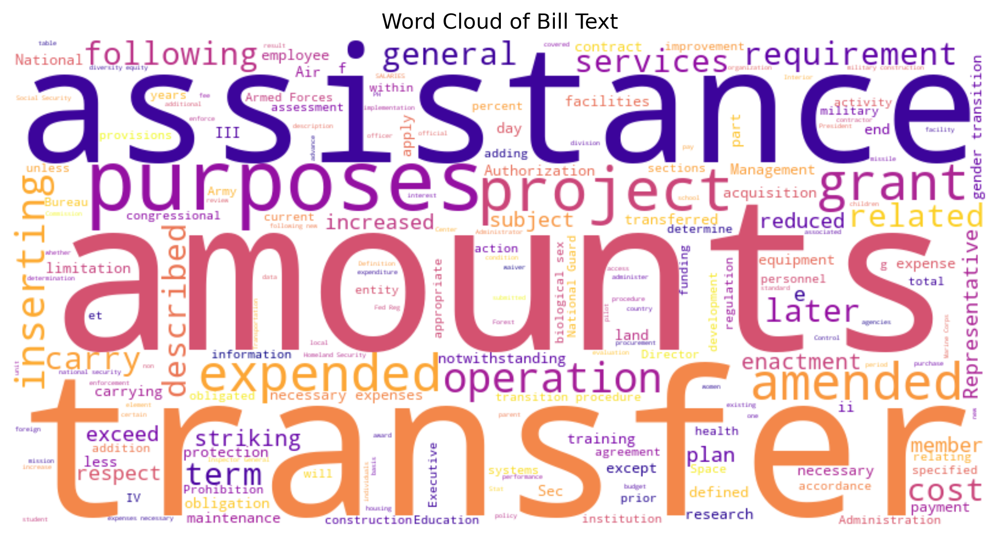
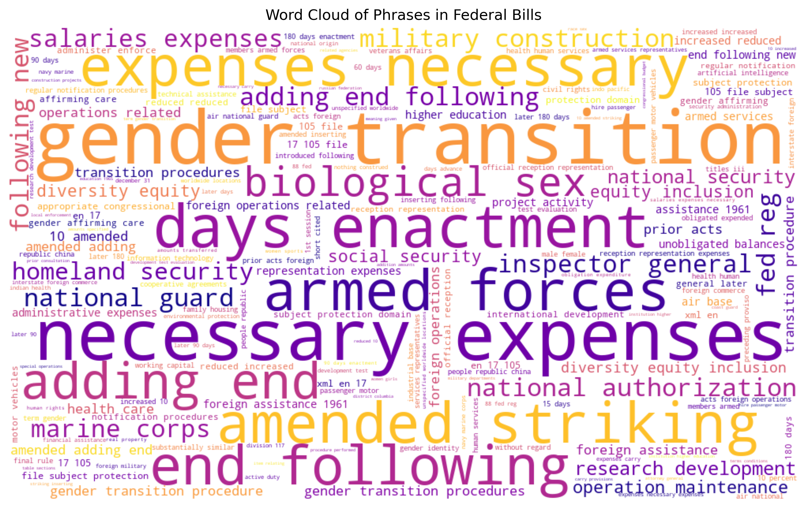

# Decoding Trans Legislation: A Python Pipeline for Federal Anti-Trans Bills (2024–2025)

**Decoding Trans Legislation** is a Python-based data pipeline and analysis-ready dataset that addresses a pressing information gap: the lack of structured, accessible data on U.S. **federal anti-trans legislation**. This project scrapes, cleans, and organizes metadata and full-text content for relevant bills introduced in 2024 and 2025.

The goal is to centralize bill data in a machine-readable format to support journalists, researchers, and advocates in analyzing the language and patterns of anti-trans legislative activity.

> ⚠️ _This project does **not** independently label legislation as "anti-trans." It preserves the categorization used by [TransLegislation.com](https://translegislation.com)._

---

## Key Contributions

### Web Scraping
- Scraped [TransLegislation.com](https://translegislation.com) to collect:
  - Bill title, caption, description, and category
  - Links to both LegiScan and congress.gov detail pages
- For 2025, prioritized **congress.gov** links due to inconsistencies in LegiScan formatting

### Structured Data Storage
- Saved content in `pandas` DataFrames for 2024 and 2025
- Exported as:  
  - `CSVs/2024CSV`  
  - `CSVs/2025CSV`  
  - `CSVs/CombinedCSV` (`df_combined`)

### Metadata Extraction & Enrichment
- Extracted:
  - Congressional session numbers from congress.gov URLs
  - Bill identifiers (e.g., `HR 10075`)
  - Standardized bill types (e.g., `hr`, `sres`) via custom mapping
- Manually filled in missing or ambiguous values where necessary

### Full-Text Retrieval & Cleaning
- Constructed direct XML links to full bill text from congress.gov using this format:  
  `https://www.congress.gov/{session}/bills/{bill_type}{bill_number}/BILLS-{session}{bill_type}{bill_number}ih.xml`
- Parsed XML with BeautifulSoup to strip tags and HTML noise
- Saved results as:
- `Texts/Bill_text.txt` – raw XML output
- `Texts/cleaned_text.txt` – cleaned text used for NLP analysis

---

## Potential Users

- **Journalists & Policy Researchers**  
Track rhetorical patterns, legislative focus, and bill language across years

- **Advocates & Organizers**  
Monitor bill activity, access raw and cleaned text for educational or legal outreach

- **Data Scientists & Computational Social Scientists**  
Apply NLP techniques such as topic modeling, clustering, or phrase analysis

---

## Files in This Repository

### Main Components

| File / Folder | Description |
|---------------|-------------|
| `tracker_federal.ipynb` | Main Python notebook with scraping, cleaning, and enrichment pipeline |
| `CSVs/` | Contains yearly and combined cleaned metadata |
| `Texts/` | Raw and cleaned full bill text files |
| `Wordclouds/` | Word cloud image outputs (single-word and n-gram based) |
| `README.md` | This documentation |
| `.gitattributes` | Git settings (e.g., for handling line endings) |

---

### Word Clouds

The project includes two word clouds generated from the cleaned full-text data:

| Image | Description |
|-------|-------------|
|  | Single-word frequency cloud from `cleaned_text.txt` |
|  | Phrase-based (bigrams and trigrams) word cloud – more policy-relevant |

---

## Next Steps

- [ ] **Align cleaned bill texts** with their corresponding rows in the combined metadata file  
- [ ] **Phase 2: Text Analysis**, including:
- Keyword extraction and topic modeling (e.g., NMF, LDA)
- Visualization of rhetorical trends by year or category
- Comparative linguistic framing of gender-related policy proposals

---

## Tools Used

- Python (pandas, BeautifulSoup, regex, scikit-learn, wordcloud, matplotlib)  
- Git & GitHub for version control  
- Jupyter Notebook for reproducibility

---

## Author

**Michaela Jackson**  
Data Analytics & Visualization, Pratt Institute (2025)  
